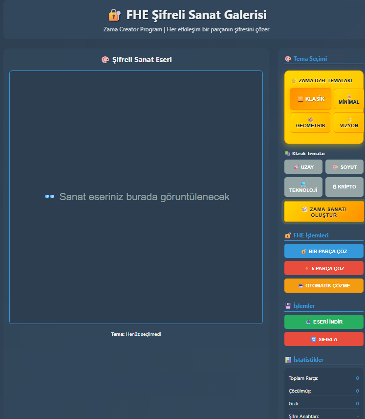
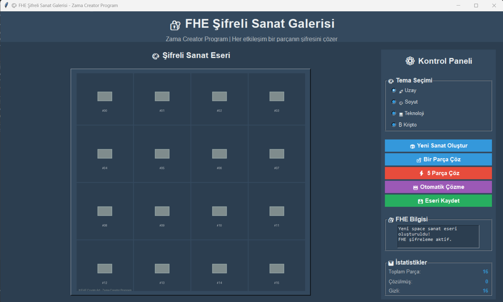
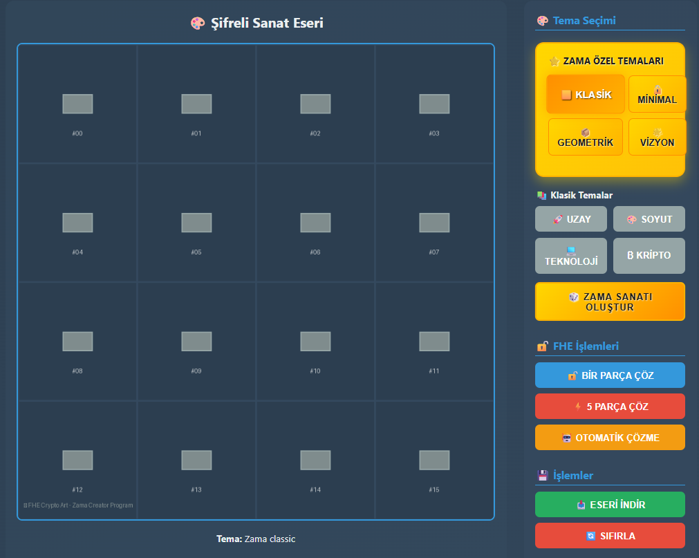

# FHE Encrypted Art Gallery

An interactive digital art project that demonstrates Fully Homomorphic Encryption (FHE) concepts through visual storytelling. Built for the Zama Creator Program.


## Overview

This project transforms complex FHE concepts into an engaging, interactive experience where users decrypt digital artwork piece by piece. Each artwork is split into encrypted segments that can only be revealed through FHE operations, creating an intuitive understanding of encrypted computation.

## Features

- **4 Zama-Inspired Themes**: Classic, Minimal, Geometric, and Vision designs
- **4 Traditional Themes**: Space, Abstract, Technology, and Cryptocurrency
- **Interactive Decryption**: Reveal artwork pieces using simulated FHE operations
- **Dual Interface**: Desktop GUI (Tkinter) and Modern Web App (Flask)
- **Real-time Statistics**: Track encryption progress and key management
- **High-Quality Export**: Save artwork in PNG format
- **Educational Content**: Learn FHE concepts through visual interaction

## Quick Start

### Prerequisites
- Python 3.8+
- pip package manager

### Installation

1. Clone the repository:
```bash
git clone https://github.com/Dr-Kudy/fhe-encrypted-art.git
cd fhe-encrypted-art
```

2. Install dependencies:
```bash
pip install -r requirements.txt
```

3. Run the application:

**Desktop Version:**
```bash
python art_app.py
```

**Web Version:**
```bash
python web_art_generator.py
# Open http://localhost:5000 in your browser
```

**Quick Test:**
```bash
python fhe_art_engine.py
```

## Project Structure

```
fhe-encrypted-art/
├── fhe_art_engine.py      # Core art generation engine
├── art_app.py             # Desktop GUI application
├── web_art_generator.py   # Flask web application
├── demo_launcher.py       # Quick launcher utility
├── requirements.txt       # Python dependencies
├── templates/             # Web templates
│   └── art_gallery.html
├── assets/               # Demo images and videos
├── docs/                # Documentation
└── README.md            # This file
```

## How It Works

1. **Art Generation**: Create themed digital artwork using matplotlib
2. **Encryption Simulation**: Split artwork into 16 pieces with simulated FHE encryption
3. **Interactive Decryption**: Users decrypt pieces one by one
4. **Progress Visualization**: Real-time display of decryption progress
5. **Educational Feedback**: Learn about FHE concepts through each interaction

## Themes

### Zama Special Themes
- **Zama Classic**: Isometric computers, 3D locks, blockchain elements
- **Zama Minimal**: Clean design with prominent encryption symbols  
- **Zama Geometric**: 3D Zama cube with FHE formula elements
- **Zama Vision**: Futuristic network visualization

### Traditional Themes
- **Space**: Stars, planets, nebula effects
- **Abstract**: Geometric shapes and color gradients
- **Technology**: Circuit patterns and binary code
- **Cryptocurrency**: Blockchain blocks and crypto symbols

## Technical Details

### FHE Simulation
While this project simulates FHE concepts for educational purposes, it demonstrates:
- Encrypted data processing
- Homomorphic operations on encrypted content
- Privacy-preserving computation principles
- Key management in encrypted systems

### Architecture
- **Backend**: Python with matplotlib for art generation
- **Web Framework**: Flask with modern responsive design
- **Desktop GUI**: Tkinter with custom styling
- **Image Processing**: PIL for encryption/decryption visualization

## Educational Value

This project serves as an introduction to FHE concepts:
- **Visual Learning**: Complex encryption concepts through art
- **Interactive Experience**: Hands-on FHE operation simulation
- **Progressive Disclosure**: Learn through gradual piece revelation
- **Real-world Application**: Understand FHE use cases

## Contributing

We welcome contributions! Please see our [Contributing Guidelines](CONTRIBUTING.md).

### Development Setup

1. Fork the repository
2. Create a feature branch: `git checkout -b feature/amazing-feature`
3. Make your changes and add tests
4. Commit your changes: `git commit -m 'Add amazing feature'`
5. Push to the branch: `git push origin feature/amazing-feature`
6. Open a Pull Request

## API Reference

### FHEArtGenerator Class

```python
from fhe_art_engine import FHEArtGenerator

# Initialize generator
generator = FHEArtGenerator()

# Generate artwork
art_path = generator.generate_base_art(theme="zama_classic")

# Encrypt into pieces
pieces = generator.encrypt_art_pieces(art_path)

# Reveal a piece
generator.reveal_piece(pieces, piece_index=0)

# Get statistics
stats = generator.get_encryption_stats(pieces)
```

## Deployment

### Web App Deployment
```bash
# Using gunicorn
pip install gunicorn
gunicorn -w 4 -b 0.0.0.0:5000 web_art_generator:app

# Using Docker
docker build -t fhe-art .
docker run -p 5000:5000 fhe-art
```

## Screenshots

| Web Interface | Desktop App | Zama Theme |
|--------------|-------------|------------|
|  |  |  |


## Roadmap

- [ ] Integration with actual FHE libraries (TFHE, SEAL)
- [ ] NFT generation capabilities
- [ ] Mobile app version
- [ ] Multiplayer collaborative decryption
- [ ] Advanced encryption algorithms
- [ ] Blockchain integration for art verification

## License

This project is licensed under the MIT License - see the [LICENSE](LICENSE) file for details.

## Acknowledgments

- **Zama Team** for FHE technology and inspiration
- **Zama Creator Program** for providing this opportunity
- **Open Source Community** for tools and libraries used

## Connect

- **GitHub**: [Dr-Kudy](https://github.com/Dr-Kudy)
- **Twitter**: [@afkuday](https://x.com/afkuday)
- **LinkedIn**: [Ahmet Faruk Kuday](https://www.linkedin.com/in/ahmet-faruk-kuday-85b373243/)

## Support

If you find this project helpful, please consider:
- Starring the repository
- Sharing it with the community
- Contributing to the codebase
- Reporting issues and suggestions

---

**Made with passion for the Zama Creator Program**

*Exploring the intersection of art, education, and cutting-edge cryptography*
